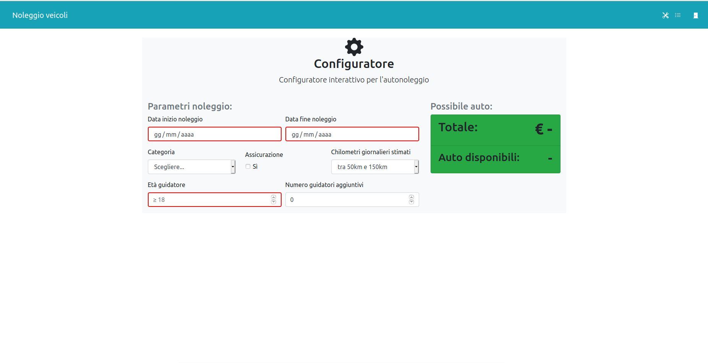

# Exam #1: "Noleggio veicoli"

## Student: s273679 AUSONIO STEFANO

## React client application routes

- Route `/`: route dove si mostra la lista delle auto e consente di filtrarle per categoria e/o marca
- Route `/login`: pagina di login
- Route `/configurator`: configuratore interattivo del noleggio per utente autenticato
- Route `/rentals`: pagina con elenco noleggi passati/attivi/futuri (quest'ultimi cancellabili) per utente autenticato

## REST API server

**_[AUTH]_** indica che per tale api è necessario essere autenticati

- GET `/api/user` _(permette di riautenticare automaticamente un utente che possiede un token valido)_ **_[AUTH]_**
  - response: ID dell'utente ed e-mail
- GET `/api/cars`
  - response: lista di auto presenti nel database
- POST `/api/login`
  - request body: json con username (i.e. e-mail) e password
  - response: cookie + json con ID dell'utente ed e-mail
- POST `/api/logout`
  - request body: vuoto
  - response: vuoto
- POST `/api/pricequantity` _(per ottenere il prezzo e il numero di auto disponibili per una determinata configurazione di noleggio)_ **_[AUTH]_**
  - request body: configurazione del noleggio
  - response: json con prezzo e numero di auto disponibili
- POST `/api/payment` _(consente di effettuare il pagamento)_ **_[AUTH]_**
  - request body: dati carta di pagamento + prezzo
  - response: successo se tutti i dati sono diversi da undefined
- POST `/api/rental` _(consente di aggiungere un noleggio dopo il pagamento)_ **_[AUTH]_**
  - request body: configurazione del noleggio
  - response: successo nell'aggiunta del noleggio o errore
- GET `/users/:userID/rentals` _(permette di ottenere tutti i noleggi di un utente)_ **_[AUTH]_**
  - request parameter: ID dell'utente
  - response: lista dei noleggi dell'utente
- DELETE `/api/rentals/:rentalID` _(consente di cancellare un noleggio futuro da parte di un utente)_ **_[AUTH]_**
  - request parameter: ID del noleggio da cancellare

## Server database

- Table `auto` - contains auto_id, categoria, marca, modello; è la tabella in cui memorizzo i dati delle auto
- Table `utenti` - contains utente_id, Nome, Cognome, mail, hash (della password); è la tabella dove memorizzo i dati degli utenti
- Table `noleggi` - contains id_noleggio, DataInizio, DataFine, utente (references utente_id), auto (references auto_id); è la tabella dove memorizzo i dettagli dei noleggi

## Main React Components

- `Header` (in `Header.js`): per l'Header della pagina, con relativi bottoni link
- `Sidebar` (in `Sidebar.js`): definisce la sidebar (della pagina iniziale) con filtri per le auto
- `CarsList` (in `CarsList.js`): permette la creazione della lista delle auto, richiama a sua volta `CarItem` per renderizzare una auto
- `LoginForm` (in `LoginForm.js`): form per effettuare l'autenticazione
- `Configurator` (in `Configurator.js`): è il componente destinato alla creazione del configuratore per il noleggio con il form
- `ModalPagamento` (in `ModalPagamento.js`): destinato alla visualizzazione e gestione del modal per il pagamento
- `Noleggi` (in `Noleggi.js`): componente destinato alla creazione della lista dei noleggi dell'user autenticato, richiama `NoleggioItem`

## Screenshot

Per navigare tra le pagine, dopo che ci si è autenticati appaiono delle svg link nello header (i.e. navbar), in alto a destra.
La possibilità di prenotare un noleggio (il pulsante per fare ciò), appare solo quando le i campi necessari del form sono riempiti e corretti.

## Test users

- mario.rossi@mail.it, password (frequent customer)
- vitale.greco@mail.it, 123456 (frequent customer)
- ivana.siciliano@mail.it, passwordmia
- galileo.bergamaschi@mail.it, 123456789 (0 rentals)
- cristina.castiglione@mail.it, autonoleggio
- romeo.toscano@mail.it, 12345678

## Implementation details

- Ho evitato di inserire nel DB informazioni come numero guidatori aggiuntivi, assicurazione ed età del guidatore in quanto non necessari nella nostra applicazione, sono però consapevole che in una applicazione reale debbano comunque esserci per poi sapere se l'utente ha fatto l'assicurazione o altri dettagli.

- Il client manda il prezzo quando manda i dati della carta, questa informazione oltre che non essere usata, non dovrebbe essere mandata così in una applicazione reale, in quanto l'utente potrebbe falsificare quel prezzo, essendo l'API di pagamento STUB è stata inviata così, inoltre nel mondo reale le API di pagamento sono fatte (in presenza di fornitori di servizi di piccole/medie dimensioni) verso una entità terza, che è la banca, e il prezzo viene fornito dal server.
